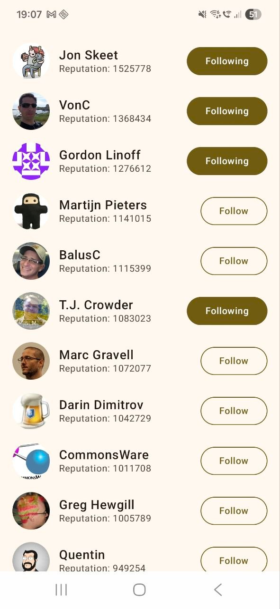

# Stack Users
The app showing the top 20 StackOverflow users (with their profile image, name and reputation). 
Also, app allows to follow and unfollow users (simulation, no real requests to backend).

## Screenshot

## Tech Stack

| Layer         | Technology                                     |
|---------------|------------------------------------------------|
| Language      | Kotlin                                         |
| UI            | Jetpack Compose                                |
| DI            | Hilt                                           |
| Networking    | Retrofit + OkHttp                              |
| Database      | Room                                           |
| Async         | Coroutines + Flow                              |
| Image loading | Coil                                           |
| Unit Test     | JUnit + Mockk                                  |
| Architecture  | Clean Architecture + MVVM (presentation layer) |

## Architecture concepts
Codebase split into layers: Data, Domain, Presentation. 
Presentation layer split into viewModels and Compose.
Dependency injection using Hilt Framework.
Unit tests. 

**NB** For the sake of time-saving:
- Not all classes covered by Unit tests 
- Not all classes looks ideally
- No git strategy was used
- UI is simple

### Setup 
1. Clone the repository
2. Open in Android Studio
3. Run the app on emulator or device
4. To see the error screen, uncomment line #27 in `UsersRepositoryImpl` class
